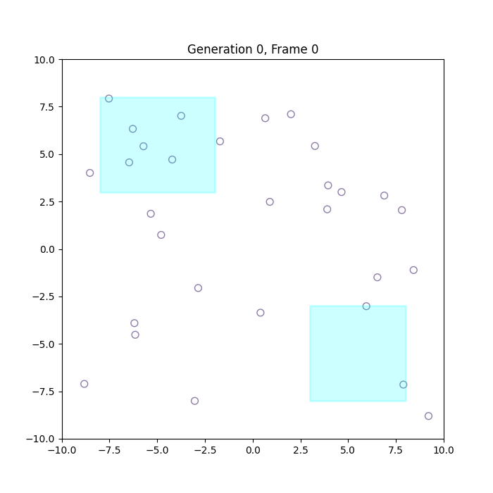

# 🧬 Darwin Meets Deep Learning: Predator–Prey Co-Evolution in a 2D World

A Jupyter notebook simulation where evolving neural networks control predator and prey agents in a 2D environment. Through neuro-evolution, these agents adapt over generations—learning to hunt, evade, forage, and survive without ever being explicitly told how.

Inspired by real-world evolutionary arms races, this project demonstrates how divergent goals and shared "genetic" architectures can produce complex, emergent behaviors via artificial selection.

👉 [Read the full story on Medium](https://medium.com/@krishnabarai160905/darwin-meets-deep-learning-teaching-neural-agents-to-survive-and-thrive-through-neuro-evolution-8e72b98a5df3)

---

## 🧠 What This Is

This simulation explores **competitive co-evolution** between two agent species:

- **Prey** evolve to *forage for food* and *avoid predators*.
- **Predators** evolve to *hunt prey* while managing their own energy and lifespan.

Each agent is powered by a **feed-forward neural network** whose weights and biases are evolved over time via a genetic algorithm. Both populations share the same genome architecture, but **opposing fitness objectives** drive divergent strategies.

---

## 📁 Project Structure

```
evo2d.ipynb         # Main simulation notebook
pop_gen999.gif            #GIF
README.md           # This file
```

---

## 🎯 Key Features

- 🧬 Dual neural populations in direct evolutionary competition
- 🤖 Shared genome architecture → divergent emergent behaviors
- 🔄 Roulette-wheel selection & uniform crossover
- 🗺️ Dynamic food vs. hazard zones create spatial risk-reward tradeoffs
- 📊 Track fitness, genetic diversity & spatial behavior over time
- 🎥 Visualize emergent strategies via heatmaps and GIFs

---

## 🚀 Getting Started

### 📦 Prerequisites

- Python 3.8+
- Jupyter Notebook
- Install core packages:
  ```bash
  pip install numpy matplotlib tqdm
  ```

### ▶️ Run the Simulation

1. Clone this repository:
   ```bash
   git clone https://github.com/yourusername/evo2d-neuroevolution.git
   cd evo2d-neuroevolution
   ```

2. Launch the Jupyter notebook:
   ```bash
   jupyter notebook evo2d.ipynb
   ```

---

## 📽️ Demo Output

> Below is a sample animation of predators vs. prey by generation 999.
> 
>  <!-- Replace with actual file path if added -->

Agents begin with erratic motion, but evolve structured migratory behaviors. Prey learn to gather near food zones and avoid edge hazards, while predators evolve flanking and pursuit paths.

---

## 📊 Tracked Metrics

- **Best vs. Average Fitness** per species
- **Genome Diversity** (weight variance)
- **Behavioral Spread** (positional standard deviation)
- **Heatmaps** of population density
- **GIF Animations** across generations (e.g., Gen 200, 800, 1000)

---

## 📚 License

This project is licensed under the **MIT License**.  
Feel free to fork, modify, and build upon this work with attribution.

---

## 🙌 Credits & Inspiration

- Written and created by **[Krishna Barai](https://medium.com/@krishnabarai160905)** · [LinkedIn](https://www.linkedin.com/in/krishna-barai-9a3889227/)
- Inspired by co-evolution in nature and neuro-evolution in AI
- Powered by classic genetic algorithms + feed-forward networks

---

